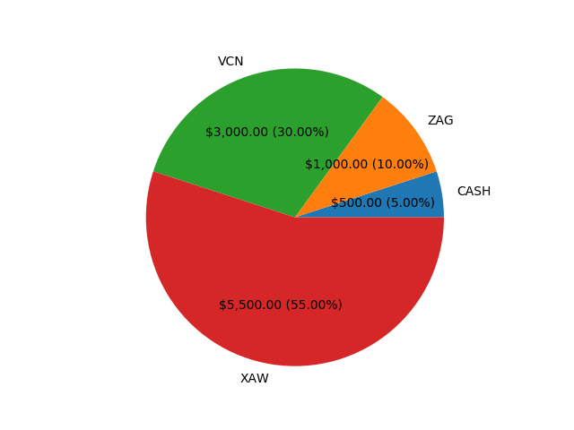
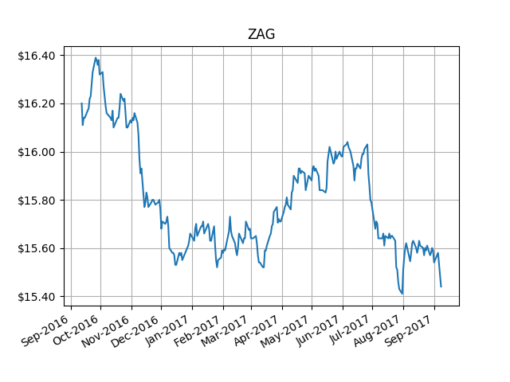

# rebalance

[](https://travis-ci.org/jordao76/rebalance)
[](https://github.com/jordao76/rebalance/blob/master/LICENSE.md)

Python code to aid in Exchange-Traded Funds (ETFs) portfolio rebalancing.

To install: with python 3, `git clone`, `cd` into it and run:

```sh
$ pip install -r requirements.txt
...
$ python setup.py install
```

Use it like this:

```python
from decimal import *
from rebalance import Instrument, CASH, Portfolio

# instruments (ETFs)
ZAG = Instrument('ZAG', 'BMO Aggregate Bond Index EFT')
VCN = Instrument('VCN', 'Vanguard FTSE Canada All Cap Index ETF')
XAW = Instrument('XAW', 'iShares Core MSCI All Country World ex Canada Index ETF')

my_portfolio = Portfolio({
    CASH: Decimal(500),
    ZAG: Decimal(1000),
    VCN: Decimal(3000),
    XAW: Decimal(5500)})
assert my_portfolio.total == Decimal(10000)

# canadian couch potato assertive model portfolio (2016)
model_portfolio = Portfolio({
    ZAG: Decimal(25),
    VCN: Decimal(25),
    XAW: Decimal(50)})
assert model_portfolio.total == Decimal(100)

orders = my_portfolio.rebalance(model_portfolio)
print(orders)
# [Order(action=Sell, instrument=VCN, amount=Decimal('500.00')),
# Order(action=Sell, instrument=XAW, amount=Decimal('500.00')),
# Order(action=Buy, instrument=ZAG, amount=Decimal('1500.00'))]
```

The results are the necessary orders to rebalance `my_portfolio` with the `model_portfolio` as a model, where an order includes the desired action (Buy or Sell), the instrument (ETF) symbol and the dollar amount (with default precision and rounding rules, discrepancies may occur).

There's also a method to plot your portfolio:

```python
import matplotlib.pyplot as plt

my_portfolio.plot()
plt.show()
```



You can also plot the prices of a security. This will use google finance and plot the daily closing prices of TSE:ZAG for a year until today:

```python
ZAG.plot_prices()
plt.show()
```


